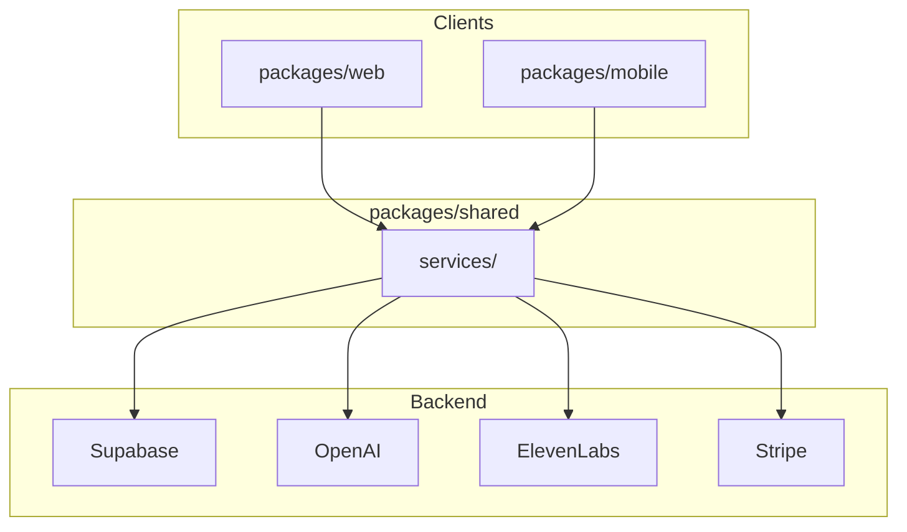

# waQup Architecture Overview

**Purpose**: Single reference for the waQup system architecture — monorepo structure, backend services, and data flows.

**Last Updated**: 2026-03-09

---

## 1. Monorepo Structure

```
waqup-new/
├── packages/
│   ├── shared/     # @waqup/shared — business logic, types, services, theme
│   ├── web/        # Next.js 16 — desktop browsers (App Router, API routes, PWA)
│   └── mobile/     # Expo 54 — React Native (iOS, Android)
├── waqup-app/      # DEPRECATED — legacy monolithic app, do not use
├── docs/
├── rebuild-roadmap/
├── supabase/       # migrations, scripts
└── scripts/        # install.sh, install.ps1, 01-04 numbered scripts
```

### packages/shared

| Subfolder | Contents |
|-----------|----------|
| `services/` | Supabase client, auth, content, storage; AI (OpenAI, ElevenLabs) |
| `stores/` | Zustand stores (auth, UI, preferences) |
| `types/` | TypeScript types |
| `utils/` | Utilities, analytics |
| `schemas/` | Zod validation schemas |
| `theme/` | Design tokens (colors, spacing, typography) — SSOT |
| `constants/` | Credit costs, AI models |
| `hooks/` | Shared React Query hooks |

### packages/web

- **Framework**: Next.js 16.1.6, React 19
- **Routes**: App Router — `(marketing)`, `(auth)`, `(main)`, `(onboarding)`, `sanctuary/`, `admin/`, `system/`
- **API routes**: `/api/ai/*`, `/api/stripe/*`, `/api/oracle/*`, `/api/voice/*`, etc.
- **Theme**: Imports from `@waqup/shared/theme`; `src/theme/format.ts` for CSS adapters

### packages/mobile

- **Framework**: Expo SDK 54, React Native 0.81.5
- **Navigation**: React Navigation — RootNavigator, AuthStack, MainNavigator (tabs)
- **Theme**: Same shared theme; `src/theme/format.ts` for RN adapters

---

## 2. Backend Services



### Supabase

- **Auth**: Email/password, Google OAuth; PKCE flow; sessions via cookie (web) or AsyncStorage (mobile)
- **Database**: PostgreSQL — `profiles`, `content_items`, `credit_transactions`, `user_voices`, `subscriptions`, etc.
- **Storage**: `audio` bucket — private, owner RLS; signed URLs for playback
- **Realtime**: `postgres_changes` on `credit_transactions` for live balance updates

### OpenAI

- **Models**: GPT-4o-mini (conversation, orb, oracle, scripts), GPT-4 (agent mode)
- **Usage**: Script generation, conversation replies, oracle responses, reflection
- **Not used**: Embeddings, OpenAI TTS (ElevenLabs used for TTS)

### ElevenLabs

- **Voice cloning**: Instant Voice Cloning (IVC) — `createInstantVoice`, `editVoice`
- **TTS**: `textToSpeech` — used by `/api/ai/tts`, `/api/ai/render`, `/api/oracle/tts`

### Stripe

- **Web**: Checkout (credits, subscription), Customer Portal, webhooks
- **Tables**: `stripe_webhook_events` (idempotency), `profiles.stripe_customer_id`
- **Mobile**: Credits displayed; checkout UI not yet implemented

---

## 3. Key Data Flows

### Auth Flow

```
Login/Signup → Supabase Auth → Session stored (cookie/AsyncStorage)
→ AuthProvider/RootNavigator checks session → Redirect to /login or main app
```

### Content Creation Flow

```
Intent → Script (LLM) → Voice (ElevenLabs IVC or user recording)
→ Audio step (/api/ai/render) → Review → Save to content_items
```

### Credits Flow

```
User action (TTS, agent, conversation) → deduct_credits RPC
→ credit_transactions insert → Realtime broadcast
→ useCreditBalance updates UI
```

---

## 4. Web vs Mobile Feature Matrix

| Feature | Web | Mobile |
|---------|-----|--------|
| Auth (email, Google) | Yes | Yes |
| Sanctuary sub-pages | Yes | Yes (Credits, Progress, Settings, Reminders) |
| Content CRUD | Full | Partial (create, library) |
| Speak / Oracle | Yes | Yes |
| Voice Orb | Yes | Component exists |
| Stripe checkout | Yes | No |
| ElevenLabs IVC | Yes | Partial (profile) |
| Audio recording | Upload only | expo-av |
| Onboarding | 4 steps | SetupScreen only |
| Marketplace | Yes | No |
| Admin/system pages | Yes | No |

---

## 5. Related Docs

- **Mobile architecture**: [docs/02-mobile/02-architecture.md](02-mobile/02-architecture.md)
- **Tech stack**: [docs/02-mobile/01-technology-stack.md](02-mobile/01-technology-stack.md)
- **Schema**: [rebuild-roadmap/01-planning/02-schema-verification.md](../rebuild-roadmap/01-planning/02-schema-verification.md)
- **Route map**: [docs/04-reference/16-route-map.md](04-reference/16-route-map.md)
